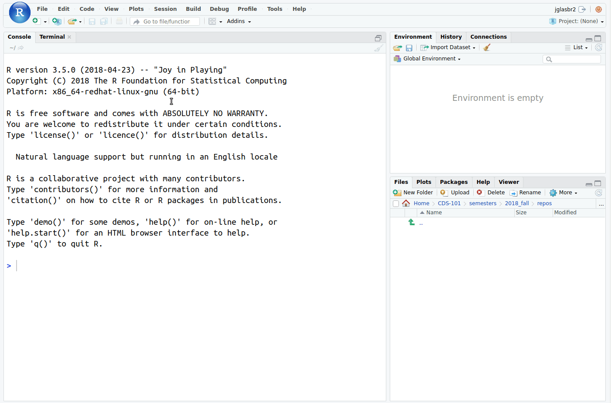
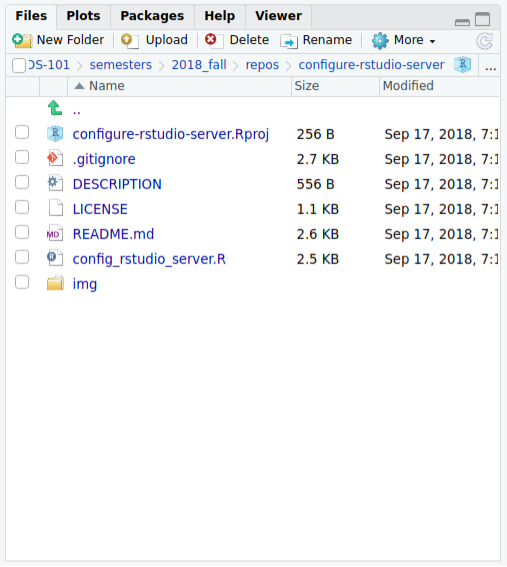
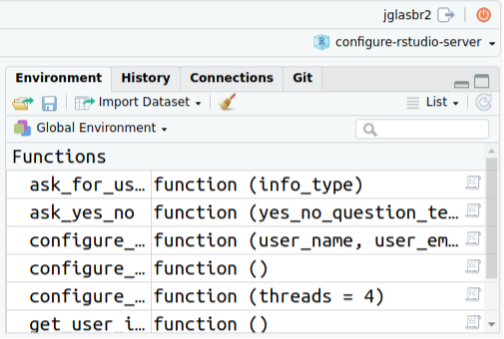

RStudio Server Configuration
============================

Overview
--------

A set of helper functions to help you configure RStudio Server for use in CDS 101.
RStudio Server is a web-app version of RStudio, a full-featured editor for R with a user-friendly design.

Prerequisites
-------------

To be able to use RStudio Server, you must:

*   Be a student at George Mason University and registered for CDS 101.

*   Using a laptop or desktop computer with a working internet connection that has up-to-date versions installed of either [Google Chrome](https://www.google.com/chrome/) (recommended) or [Mozilla Firefox](https://www.mozilla.org/en-US/firefox/).
    *The RStudio Server page may not render correctly if you access it using Apple Safari, Microsoft Edge, and Internet Explorer, or if you try to access it using a phone or tablet.*
    
Instructions
------------

Navigate to RStudio Server at <https://rstudio.cos.gmu.edu> and login using your NetID and password.
If you cannot login, please post a message in the [\#r-rstudio-github-help](https://masoncds101.slack.com/messages/CASUNTFNX) Slack channel.
Once you are logged in, clone this repository as a new project in RStudio Server by clicking on the **New Project** button, then **Version Control**, then **Git**, and then paste `https://github.com/mason-fa18-cds-101-dl1/configure-rstudio-server.git` into the *Repository URL* box, and finally click **Create Project**.



After the repository is cloned, you should see the following files in the file browser window in the lower right of RStudio Server.



Confirm that a file named `config_rstudio_server.R` is visible in that window, then type the following in the R Console window:

```r
source("config_rstudio_server.R")
```

This will load helper functions into your R environment.
Next, type the following in the R Console to begin the configuration procedure:

```r
configure_rstudio()
```

When you run the above function, you will see the following input prompt:

    RStudio Server setup options
    
      1. First-time setup
      2. Install packages for CDS 101
      
    Enter setup option:
    
If this is the first-time you're running `configure_rstudio()`, input <kbd>1</kbd> and press <kbd>Enter</kbd>.
You'll then be asked for the following information:

    Enter your first name:
    Enter your last name:
    Enter your email address:

Input your information and verify that it is correct, then wait for the first-time setup to complete.
You will then see the following message:

    🔴 Restart RStudio Server session by clicking the Red Button in the upper right-hand corner.
    🔴 Resume setup after the restart by reloading the configure-rstudio-server project, and then 
       sourcing the config_rstudio_server.R file:
       source("config_rstudio_server.R")
    🔴 Select setup option '2' to install packages needed for CDS 101.

Restart the session as instructed by pressing the red button.



After the restart is complete, reload the `configure-rstudio-server` project.


After the project finishes loading, resume the installation by running `source("config_rstudio_server.R")` in the Console window and entering <kbd>2</kbd>.
This will start the process of downloading and installing the packages you'll need for the course, which will take a while.
At this point you can close your browser tab, as the installation will continue in the background.
Once all the packages are successfully installed, RStudio Server will be ready to use in CDS 101!

License
-------

[GPLv3](https://www.gnu.org/licenses/gpl-3.0.en.html)
